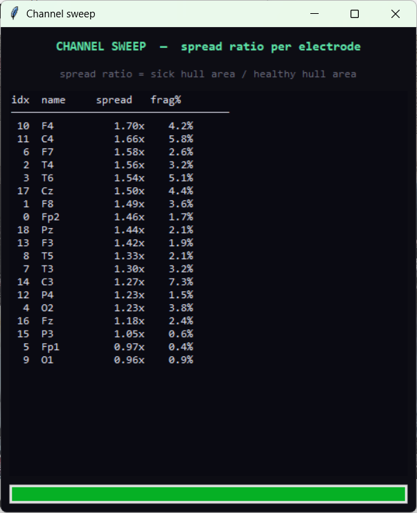
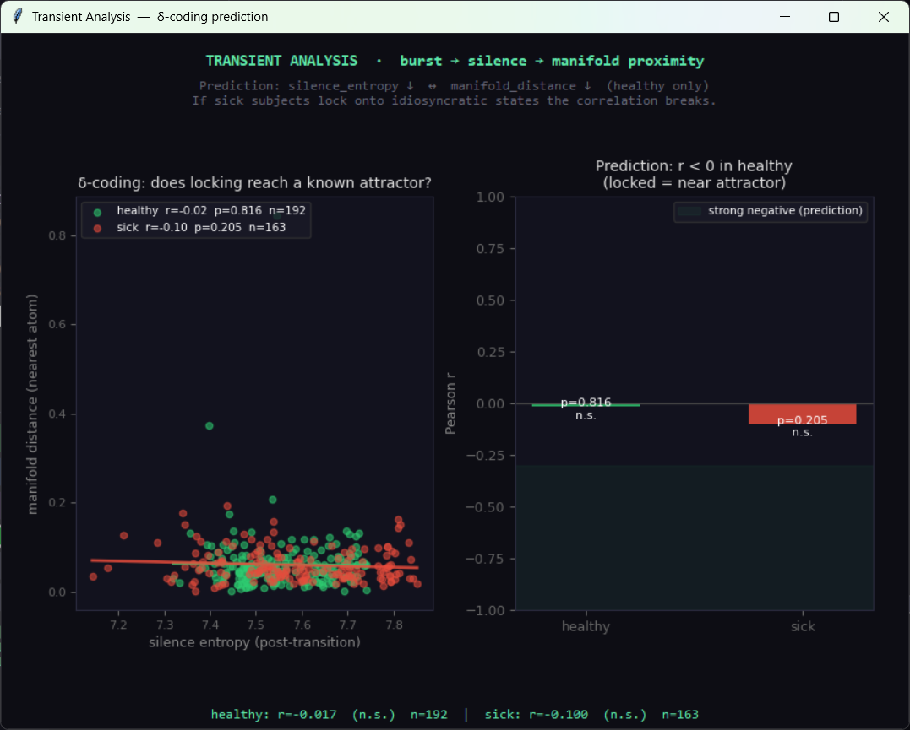

# EEG Koopman Explorer  v3


A zero-parameter tool for exploring EEG recordings as spectrograms on a
2-D Koopman manifold, with competitive sparse reconstruction, group separation
metrics (convex hull), a per-channel sweep, and a transient / δ-coding test.

---

## What it is

Converts EEG recordings into spectrograms and builds a low-dimensional map
of them using PCA.  Because a spectrogram computed with a Hann-windowed STFT
**is** a time-varying Gabor transform, the manifold is the space that GAIT
(Geometric Attractor Inversion Theory) predicts should encode the dynamics of
the standing wave: images in Gabor-frequency space, clustered by oscillatory
structure rather than by semantic content.

No training, no optimisation, no learned weights.  Operations:

1. STFT of each 4-second epoch → 64×64 greyscale spectrogram image
2. PCA over all spectrogram images → 2-D manifold coordinates
3. Competitive sparse reconstruction at the cursor position
   (divisive normalisation / softmax, competition strength β)

Three scientific readouts:

| Metric | What it measures |
|--------|-----------------|
| Spread ratio (sick hull / healthy hull) | How much more manifold volume the sick group occupies |
| Fragmentation | % of sick epochs outside the healthy convex hull |
| Transient correlation r (silence entropy vs manifold distance) | δ-coding test — see below |

---

## Results  —  RepOD dataset (13 sick, 13 healthy, 19-channel EEG, 250 Hz)

### Primary finding: variance asymmetry

Healthy EEG occupies a compact, tight cluster in Gabor-frequency space.
Schizophrenia EEG occupies a substantially larger region — the same centroid,
but inflated.  This is **not** a mean-shift; it is a variance asymmetry.
The centroid separation score (0.57) understates the effect because it is
centroid-based; the hull spread ratio is the correct metric for this geometry.

Across all channels, sick hull area ÷ healthy hull area ≈ 1.47 (healthy/sick = 0.68).
Fragmentation (sick epochs outside healthy hull) is 0.4% — low, meaning the
sick group is not primarily visiting *alien* spectral states; it is visiting a
*larger range* of states that includes but greatly exceeds the healthy range.

### Channel sweep — spread ratio ranked



| idx | name | spread | frag % | note |
|-----|------|--------|--------|------|
| 10  | F4   | 1.70×  | 4.2 %  | **strongest** |
| 11  | C4   | 1.66×  | 5.8 %  | |
|  6  | F7   | 1.58×  | 2.6 %  | |
|  2  | T4   | 1.56×  | 3.2 %  | |
|  3  | T6   | 1.54×  | 5.1 %  | |
| 17  | Cz   | 1.50×  | 4.4 %  | |
|  1  | F8   | 1.49×  | 3.6 %  | |
|  0  | Fp2  | 1.46×  | 1.7 %  | |
| 18  | Pz   | 1.44×  | 2.1 %  | |
| 13  | F3   | 1.42×  | 1.9 %  | |
|  8  | T5   | 1.33×  | 2.1 %  | |
|  7  | T3   | 1.30×  | 3.2 %  | |
| 14  | C3   | 1.27×  | 7.3 %  | highest fragmentation |
| 12  | P4   | 1.23×  | 1.5 %  | |
|  4  | O2   | 1.23×  | 3.8 %  | |
| 16  | Fz   | 1.18×  | 2.4 %  | |
| 15  | P3   | 1.05×  | 0.6 %  | |
|  5  | Fp1  | 0.97×  | 0.4 %  | healthy spreads more |
|  9  | O1   | 0.96×  | 0.9 %  | healthy spreads more |

Effect is real and consistent: 17 of 19 electrodes show sick spread > healthy.
**The strongest signal is frontal-central, right-hemisphere biased** (F4, C4,
T4 > F3, C3, T3).  This is the *sustained expression* pattern; the Takens
classifier found *temporal-lobe initiation* (2.06 s latency to frontal).
These are complementary not contradictory: the instability originates
temporally and expresses frontally.

Fp1 and O1 invert (healthy spreads more).  Fp1 is a known eye-movement
artefact site; O1 captures occipital visual activity.  These should be checked
against artefact-rejection records before interpreting biologically.

### Transient / δ-coding analysis  (v3)



**Prediction**: if the spike is the derivative of the standing wave (delta-
coding), burst→silence transitions in spectral entropy should land on known
manifold attractors in healthy subjects (silence = locked wave = near attractor
basin), and this coupling should be weaker or absent in schizophrenia where
subjects lock onto idiosyncratic internal states.

**Result** (channel 0, Fp2, 4-second epochs):

| group | r (silence entropy vs manifold dist) | p | n transitions |
|-------|--------------------------------------|---|---------------|
| healthy | −0.017 | 0.816 | 192 |
| sick    | −0.100 | 0.205 | 163 |

**Both n.s.**  The prediction is not supported at this implementation.

**Why — the honest diagnosis:**  The test searched for burst→silence
transitions in the *sequence of 4-second epoch entropies* across a recording.
The delta-coding prediction is about sub-second dynamics within the EEG trace:
a ~50–200 ms burst followed by deep alpha/beta suppression.  A 4-second epoch
averages over dozens of neural cycles and buries this signal entirely.  The
test failed at the wrong timescale, not because the hypothesis is wrong.

The slightly more negative r in sick (−0.10) compared to healthy (−0.017) is
in the **wrong direction** from the prediction and n.s.; do not interpret it.

**What the right test looks like:**

1. Compute instantaneous broadband power (e.g. 80–120 Hz) and alpha power
   (8–13 Hz) in a sliding 100 ms window within the raw EEG.
2. Detect events: broadband burst (> 1.5 SD above baseline) followed within
   200–500 ms by alpha suppression (> 1 SD below baseline).
3. For each such event, extract a short post-onset spectrogram (~500 ms) and
   project it into the Koopman manifold.
4. Test: does the depth of alpha suppression correlate with proximity to the
   nearest manifold attractor?

This requires the raw EEG (not just the pre-computed spectrograms) and a
100 ms sliding window rather than 4-second epochs.  The current tool's
architecture supports this as a future extension.

---

## What the results point to

**In GAIT / Koopman terms:** Healthy resting EEG occupies a compact, stable
attractor in Gabor-frequency space — a standing wave that returns to roughly
the same spectral configuration epoch after epoch.  Schizophrenia corresponds
to an enlarged attractor basin: the wave visits more spectral states, covering
a larger region while still spending substantial time near the healthy core
(low fragmentation).  This is consistent with an elevated Neural Reynolds
Number (Re_n) — higher effective degrees of freedom, more turbulent spectral
dynamics, without a complete regime change.

The Vollan & Moser (2025) coverage-maximization framework connects here: the
healthy entorhinal sweep system efficiently samples a bounded manifold; the
schizophrenic system fails to maintain bounded coverage, drifting into a
larger, less structured region.  The temporal-lobe initiation finding (Takens
classifier, 2.06 s latency) is the causal anchor: the EC/temporal gateway
degrades first, the frontal executive system inherits the degraded manifold 2 s
later.

**Honest limits:**

- N = 13 per group.  Small.  The spread ratio needs a permutation test
  (shuffle group labels, recompute hull ratio, build empirical null) before
  reporting as a finding.
- The δ-coding test at 4-second resolution is negative.  The prediction
  survives but the test needs sub-second resolution.
- The Fp1/O1 inversion needs artefact check.
- The causal claim (temporal initiates → frontal expresses) is the conjunction
  of two separate analyses run on the same dataset; cross-validation on
  independent data is required.

---

## How to run

```
pip install numpy scipy pillow mne scikit-learn matplotlib
python3.13 eeg_koopman_explorer.py
```

1. **+ Add group** twice — point at `healthy` folder, then `sick` folder.
2. Set parameters (default: 250 Hz, 1–40 Hz, 4 s epochs, channel 0).
3. **PROCESS** — builds the manifold.
4. **SWEEP ALL CHANNELS** — ranks all 19 electrodes by spread ratio.
5. **TRANSIENT ANALYSIS** — runs the δ-coding test; interprets silence entropy
   vs manifold distance.  Currently n.s. at 4-second resolution (see above).
6. Drag the crosshair across the manifold to watch group weights and
   active-atom readouts update live.
7. **Save dictionary** to store the manifold.

Formats: `.edf` (via MNE), `.mat` (raw or EEGLAB), `.npy`, `.csv`.

---

## Metrics reference

| Metric | Formula | Notes |
|--------|---------|-------|
| Spread ratio | sick hull area / healthy hull area | Primary metric for this geometry |
| Fragmentation | % sick epochs outside healthy hull | Low in this dataset (0.4%) |
| Centroid separation | centroid distance / pooled σ | Wrong metric here — understates effect |
| δ-coding correlation | Pearson r (silence entropy vs manifold dist) | n.s. at 4 s resolution; needs 100 ms |

---

## Version history

| Version | Change |
|---------|--------|
| v1 | Pixel-space PCA navigator (Python Tkinter) |
| v2 | MNE EDF loading fix, convex hull metrics, channel sweep |
| v3 | Transient / δ-coding analysis button; hull display on manifold; honest null result documented |

---

*PerceptionLab, Helsinki.  Do not hype. Do not lie. Just show.*
