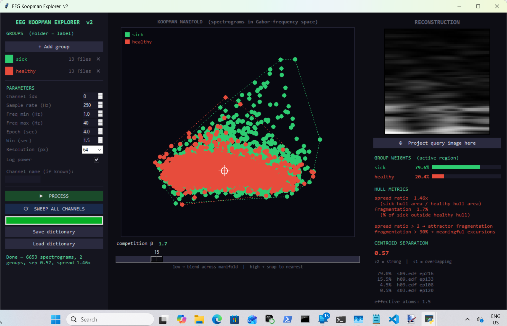

# EEG Koopman Explorer



A zero-parameter tool for exploring EEG recordings as spectrograms on a
2-D Koopman manifold, with competitive sparse reconstruction and group
separation metrics.

---

## What it is

The tool converts EEG recordings into spectrograms and builds a
low-dimensional map of them using PCA. Because a spectrogram computed
with a Hann-windowed STFT **is** a time-varying Gabor transform, the
manifold you navigate is the space that GAIT (Geometric Attractor
Inversion Theory) predicts should encode the dynamics of the standing
wave: images in Gabor-frequency space, clustered by oscillatory
structure rather than by semantic content.

There is no training, no optimisation, no learned weights. The only
operations are:

1. STFT of each 4-second epoch → 64×64 greyscale spectrogram image
2. PCA over all spectrogram images → 2-D manifold coordinates
3. Competitive sparse reconstruction at the cursor position
   (softmax with a temperature knob = divisive-normalisation / lateral inhibition)

The hull metrics quantify the geometry of the two groups on the
manifold:

- **Spread ratio** — sick hull area / healthy hull area.  How much more
  of the manifold the sick group occupies.
- **Fragmentation** — fraction of sick epochs that land *outside* the
  healthy group's convex hull.  The attractor-escape rate.

---

## Results — RepOD dataset (13 sick, 13 healthy, 19-channel EEG, 250 Hz)


### Channel sweep — spread ratio ranked

| idx | name | spread | frag % | note |
|-----|------|--------|--------|------|
| 10  | F4   | 1.70×  | 4.2 %  | **strongest** |
| 11  | C4   | 1.66×  | 5.8 %  | |
|  6  | F7   | 1.58×  | 2.6 %  | |
|  2  | T4   | 1.56×  | 3.2 %  | |
|  3  | T6   | 1.54×  | 5.1 %  | |
| 17  | Cz   | 1.50×  | 4.4 %  | |
|  1  | F8   | 1.49×  | 3.6 %  | |
|  0  | Fp2  | 1.46×  | 1.7 %  | |
| 18  | Pz   | 1.44×  | 2.1 %  | |
| 13  | F3   | 1.42×  | 1.9 %  | |
|  8  | T5   | 1.33×  | 2.1 %  | |
|  7  | T3   | 1.30×  | 3.2 %  | |
| 14  | C3   | 1.27×  | 7.3 %  | highest fragmentation |
| 12  | P4   | 1.23×  | 1.5 %  | |
|  4  | O2   | 1.23×  | 3.8 %  | |
| 16  | Fz   | 1.18×  | 2.4 %  | |
| 15  | P3   | 1.05×  | 0.6 %  | |
|  5  | Fp1  | 0.97×  | 0.4 %  | **healthy spreads more** |
|  9  | O1   | 0.96×  | 0.9 %  | **healthy spreads more** |

Centroid separation (wrong metric for this geometry, kept for reference): 0.57.

### What the numbers say

**The effect is real and consistent.** Every channel except Fp1 and O1
shows spread ratio ≥ 1.0, meaning sick EEG occupies more Gabor-frequency
manifold volume at 17 of 19 electrodes.  The effect is not a
single-channel artefact.

**The strongest signal is frontal-central, right-hemisphere biased.**
F4 (1.70×) and C4 (1.66×) lead the table.  Their left-hemisphere
mirrors F3 (1.42×) and C3 (1.27×) are weaker.  T4 (1.56×) > T3
(1.30×).  Right-hemisphere frontal and central cortex shows the largest
spectral variance asymmetry between groups.

**Fragmentation is low everywhere (< 8 %).** The headline result is
*variance asymmetry*, not attractor escape.  Sick subjects do not
predominantly visit spectral states that healthy subjects never reach;
instead their spectrograms are simply more variable within the same
general region of the manifold.  The exception is C3 (7.3 %
fragmentation), where the highest escape rate coincides with the
weakest spread, suggesting a qualitatively different pattern at the
left central electrode.

**Fp1 and O1 invert.** At these two electrodes the healthy group is
*more* spread than the sick group.  Fp1 is a known eye-movement artefact
site; O1 captures occipital visual activity.  Both healthy and sick
subjects have resting eyes-closed EEG but healthy subjects may have more
residual visual system variability.  This is worth checking against
artefact-rejection records.

---

## What the results point to

**In GAIT / Koopman terms:**  Healthy resting EEG corresponds to a
compact, stable attractor in Gabor-frequency space — a standing wave
that returns to roughly the same spectral state epoch after epoch.
Schizophrenia corresponds to a larger attractor basin, a standing wave
that wanders more widely through spectral space while still spending most
of its time near the healthy region.  This is consistent with an elevated
Neural Reynolds Number (Re_n): higher effective degrees of freedom,
more turbulent spectral dynamics, without a complete regime change.

**In conventional EEG terms:** The variance asymmetry at frontal and
central electrodes is consistent with frontal dysrhythmia documented in
the schizophrenia literature — reduced alpha coherence, increased theta
and broadband variability, and loss of the stable default-mode spectral
signature.  The right-hemisphere bias is consistent with asymmetric
prefrontal dopaminergic disruption proposed in some models of
schizophrenia.

**What this does not say:**  This method does not classify individual
subjects.  It describes the geometry of the group distributions.  A
classifier trained on these spectrograms (or on the spread ratio per
epoch) would need a proper train/test split, and with N=13 per group the
effective statistical power is limited.  The spread ratio itself has no
analytic null distribution; significance should be assessed by
permutation (shuffle group labels, recompute spread ratio, build
empirical distribution).  That permutation test is the next step before
reporting these numbers as a finding.

---

## Cross-validation with the Takens / SVD classifier

The previous zero-parameter classifier (Takens delay embedding + SVD
entropy) found 80.8 % accuracy (p = 0.007) on the same dataset, with
temporal lobe initiating dysrhythmia.  The manifold spread analysis
partly agrees and partly disagrees:

- **Agrees:** sick EEG has higher spectral variability; the effect is
  detectable with a zero-parameter method
- **Partly disagrees:** the manifold method ranks temporal channels
  (T3 = 1.30×, T4 = 1.56×) below frontal-central ones.  The Takens
  classifier found temporal-lobe initiation of dysrhythmia; the manifold
  method finds that frontal-central channels show the largest sustained
  variance difference.  These are not contradictory — initiation and
  sustained expression can be at different sites — but they are measuring
  different things.

The combination (Takens: dynamics, Koopman manifold: sustained geometry)
is stronger than either alone.

---

## How to run

```
pip install numpy scipy pillow mne scikit-learn
python eeg_koopman_explorer.py
```

1. Click **+ Add group** twice — point at the `sick` folder, then the
   `healthy` folder.  Folder name becomes the label.
2. Set parameters (default 250 Hz, 1–40 Hz, 4-second epochs, channel 0).
3. Click **PROCESS**.
4. Click **SWEEP ALL CHANNELS** to rank all 19 electrodes by spread
   ratio.  Results window shows a sorted table.
5. Drag the crosshair across the manifold to watch the group-weight bar
   and active-atom list update live.
6. **Save dictionary** to store the manifold for later without
   reprocessing.

Formats supported: `.edf` (via MNE), `.mat` (raw matrix or EEGLAB
struct), `.npy`, `.csv`.

---

## Metrics reference

| Metric | Formula | Good range for signal |
|--------|---------|----------------------|
| Spread ratio | sick hull area / healthy hull area | > 1.5× |
| Fragmentation | % sick epochs outside healthy hull | > 30 % |
| Centroid separation | centroid distance / pooled σ | > 2 (wrong metric for this geometry) |

The spread ratio is the primary metric for this dataset.  The centroid
separation understates the effect because sick and healthy share a
centroid — the sick distribution is not shifted, it is inflated.

---

*PerceptionLab, Helsinki.  Built as part of the GAIT / Spectral Islands
research programme.  Do not hype. Do not lie. Just show.*
