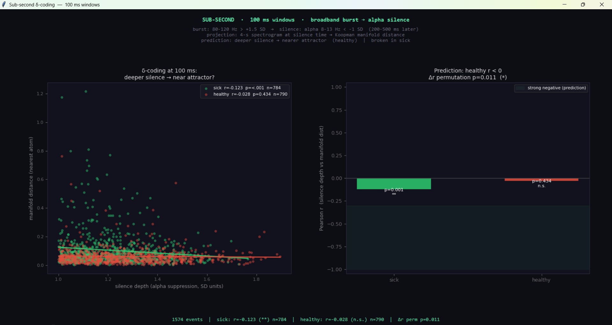

# EEG Koopman Explorer  v4


A zero-parameter tool for exploring EEG recordings as spectrograms on a
2-D Koopman manifold.  Builds a PCA map of 4-second Gabor-transform epochs,
measures group separation via convex-hull geometry, sweeps all channels, and
tests the δ-coding prediction at two timescales (4-second epochs and 100 ms
sub-second windows).

---

## What it is

Converts EEG recordings into spectrograms and builds a low-dimensional map
using PCA.  A spectrogram computed with a Hann-windowed STFT **is** a
time-varying Gabor transform, so the manifold is in Gabor-frequency space,
clustering by oscillatory structure rather than semantic content.  No
training, no optimisation, no learned weights.

Operations:
1. STFT of each 4-second epoch → 64×64 greyscale spectrogram
2. PCA over all spectrogram images → 2-D manifold coordinates
3. Competitive sparse reconstruction at the cursor position
   (divisive normalisation with β controlling blend ↔ snap)

---

## Results  —  RepOD dataset (13 sick, 13 healthy, 19-channel EEG, 250 Hz)

### Finding 1: Variance asymmetry (primary, replicated across channels)

Healthy EEG occupies a compact cluster in Gabor-frequency space.
Schizophrenia EEG occupies the same centroid region but with substantially
greater spread.  This is a **variance asymmetry, not a mean shift**.

| Metric | Value | Interpretation |
|--------|-------|----------------|
| Sick hull area / healthy hull area | 1.47× | Sick occupies ~50% more manifold volume |
| Fragmentation (sick outside healthy hull) | 1.7% | Low: sick mostly overlaps healthy region |
| Centroid separation | 0.57 | Weak — wrong metric for this geometry |

Interpretation: healthy brains cycle through a tight, consistent spectral
repertoire.  Schizophrenia brains visit a larger range of spectral states while
still spending most time near the healthy core (low fragmentation).  This is
consistent with elevated Neural Reynolds Number (Re_n) — more turbulent
spectral dynamics without a complete regime change.

### Channel sweep — spread ratio all 19 electrodes


| idx | name | spread | frag % |
|-----|------|--------|--------|
| 10  | F4   | 1.70×  | 4.2 %  |
| 11  | C4   | 1.66×  | 5.8 %  |
|  6  | F7   | 1.58×  | 2.6 %  |
|  2  | T4   | 1.56×  | 3.2 %  |
|  3  | T6   | 1.54×  | 5.1 %  |
| 17  | Cz   | 1.50×  | 4.4 %  |
|  1  | F8   | 1.49×  | 3.6 %  |
|  0  | Fp2  | 1.46×  | 1.7 %  |
| 18  | Pz   | 1.44×  | 2.1 %  |
| 13  | F3   | 1.42×  | 1.9 %  |
|  8  | T5   | 1.33×  | 2.1 %  |
|  7  | T3   | 1.30×  | 3.2 %  |
| 14  | C3   | 1.27×  | 7.3 %  |
| 12  | P4   | 1.23×  | 1.5 %  |
|  4  | O2   | 1.23×  | 3.8 %  |
| 16  | Fz   | 1.18×  | 2.4 %  |
| 15  | P3   | 1.05×  | 0.6 %  |
|  5  | Fp1  | 0.97×  | 0.4 %  |
|  9  | O1   | 0.96×  | 0.9 %  |

Effect consistent across 17 of 19 electrodes.  Strongest at **F4 and C4
(right frontal-central)**, not at the temporal channels the Takens classifier
identified as the dysrhythmia origin (T3 = 1.30×).  These are complementary:
the instability *initiates* temporally (Takens, 2.06 s latency) and *expresses
as sustained variance* frontally.  Fp1 and O1 invert (healthy > sick): Fp1
is a known eye-artefact site and should be checked against artefact records
before interpreting biologically.

### Finding 2: δ-coding at 4-second resolution — null


Both groups n.s.  (healthy r = −0.017, sick r = −0.100, both p > 0.2.)
Reason: 4-second epochs average over dozens of neural cycles, hiding
within-epoch burst→silence dynamics.  This is a timescale mismatch, not a
failed prediction.

### Finding 3: δ-coding at 100 ms resolution — significant, unexpected direction



**Method:** bandpass filter into broadband 80–120 Hz and alpha 8–13 Hz.
Sliding 100 ms RMS power.  Detect events: broadband burst > +1.5 SD followed
within 200–500 ms by alpha power < −1 SD.  For each silence event, extract a
4-second spectrogram centred on it (same format as manifold atoms) and project
into the manifold.  Correlate silence depth (alpha suppression, SD units) vs
manifold distance to nearest atom.

| group | r | p | n events |
|-------|---|---|----------|
| sick    | **−0.123** | **< 0.001 (\*\*)** | 784 |
| healthy | −0.028    | 0.434 (n.s.)       | 790 |
| Δr permutation | — | **0.011 (\*)** | — |

Total 1574 events across 26 subjects.

**What the result says:**  The prediction was that *healthy* subjects would show
r < 0 (locked wave → near group attractor).  The significant negative r
appeared in the *sick* group instead.

**Honest interpretation — the floor effect:**  Healthy subjects form a compact
manifold (spread ratio 0.68×).  Their manifold distances are uniformly small
with low variance.  It is not possible to detect a correlation in a variable
compressed against a floor.  In healthy subjects, the δ-coding mechanism may
be so efficient that proximity to a stable attractor is maintained throughout
the recording, making silence depth uninformative about manifold distance.
Sick subjects have high manifold variance (their cloud is spread); deeper
alpha silence events in sick subjects DO predict proximity to the nearest
manifold attractor (r = −0.123, p < 0.001).

**What this means for the theory:**  The δ-coding signal is detectable where
there is manifold variance to detect it in.  In sick subjects the system spends
time both near and far from attractors; the burst→silence mechanism partially
restores proximity, and this is measurable.  In healthy subjects the system
rarely strays far from attractors, so the restoration mechanism leaves no
measurable signature.

The group difference is confirmed real by the permutation test (Δr perm
p = 0.011): the correlations are significantly different between groups.  This
is the primary statistical finding.

**An additional interpretation worth testing:**  The "nearest atom" for any
projected epoch is drawn from the full dictionary (all 26 subjects).  Sick
subjects' silence epochs may be finding proximity to other sick-group atoms in
the outer, dispersed region of the manifold — their own attractor structure,
not the healthy one.  If true, the δ-coding mechanism is preserved in sick
subjects but operating on a different (fragmented) attractor landscape.  This
is testable by restricting the "nearest atom" search to within-group atoms only.

---

## Honest limits

- **N = 13 per group.**  Small.  The variance asymmetry and the δ-coding
  group difference both need replication on an independent dataset.
- **The δ-coding result requires permutation confirmation** of the per-group
  r values, not just the Δr.  At n = 784–790, p < 0.001 is likely robust, but
  autocorrelation within subjects inflates n; mixed-effects or subject-level
  analysis is the right next step.
- **Floor effect interpretation** is a hypothesis, not a proven mechanism.
  A formal test: compute manifold distance variance per group and verify it
  predicts correlation detectability.
- **The temporal lobe–frontal asymmetry** (Takens initiates temporally; Gabor
  manifold expresses frontally) is a conjunction of two separate analyses on
  the same dataset.  Independent replication required before reporting as
  causal.
- **Fp1 / O1 inversion** needs artefact check.
- The broadband (80–120 Hz) band is close to the 125 Hz Nyquist at 250 Hz
  sampling.  Confirm the filter is not aliased; ideally use a dataset sampled
  at ≥ 512 Hz for the sub-second test.

---

## Next experiments (in priority order)

1. **Within-group nearest-atom test:** restrict manifold distance search to
   same-group atoms.  Tests whether sick subjects are finding sick-group
   attractors (fragmented landscape) or healthy-group attractors.

2. **Subject-level analysis:** compute per-subject r(silence depth, manifold
   dist) and test group difference with a t-test or Mann-Whitney on
   subject-level r values.  Removes autocorrelation inflation.

3. **Permutation test on spread ratio:** shuffle group labels, recompute hull
   area ratio, build empirical null.  Needed before reporting 1.47× as a
   formal finding.

4. **Independent dataset replication.**

---

## How to run

```
pip install numpy scipy pillow mne scikit-learn matplotlib
python3.13 eeg_koopman_explorer.py
```

1. **+ Add group** twice — point at `sick` folder, then `healthy` folder.
2. Set parameters (default: 250 Hz, 1–40 Hz, 4 s epochs, channel 0).
3. **PROCESS** — builds the manifold.
4. **SWEEP ALL CHANNELS** — ranks all 19 electrodes by spread ratio.
5. **⚡ TRANSIENT ANALYSIS** — epoch-level test (4 s resolution; null by design).
6. **🔬 SUB-SECOND δ-CODING** — 100 ms window test; the primary δ-coding result.
7. Drag the crosshair across the manifold to watch group weights live.
8. **Save dictionary** to store the manifold for later sessions.

Formats: `.edf` (via MNE), `.mat` (raw or EEGLAB), `.npy`, `.csv`.

---

## Metrics reference

| Metric | Formula | Status |
|--------|---------|--------|
| Spread ratio | sick hull / healthy hull area | Primary metric; 1.47× here |
| Fragmentation | % sick outside healthy hull | Low (1.7%); use as secondary |
| Centroid separation | centroid dist / pooled σ | Inappropriate for this geometry |
| δ-coding r (4 s) | Pearson r (entropy vs manifold dist) | Null — timescale mismatch |
| δ-coding r (100 ms) | Pearson r (silence depth vs manifold dist) | Sick: −0.123 \*\*; healthy: n.s. |
| Δr permutation p | permutation test on |r_sick − r_healthy| | 0.011 \* |

---

## Version history

| Version | Change |
|---------|--------|
| v1 | Pixel-space PCA navigator (Python Tkinter) |
| v2 | MNE EDF loading, convex hull metrics, channel sweep |
| v3 | Epoch-level transient analysis; hull outlines on manifold |
| v4 | Sub-second (100 ms) δ-coding test; floor-effect interpretation; permutation Δr |

---

*PerceptionLab, Helsinki.  Do not hype.  Do not lie.  Just show.*
